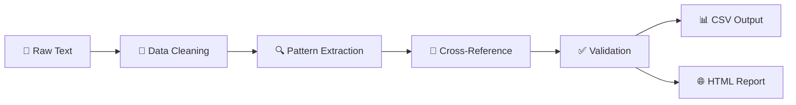

# ♟️ Chess Tournament Data Analysis Project

<div align="center">


**Transform messy chess tournament data into clean, analyzable datasets!**

</div>

---

## 🎯 Project Overview

This project tackles the challenge of converting **unstructured chess tournament text files** into clean, machine-readable CSV data. Perfect for tournament organizers, chess analysts, and data enthusiasts who need to work with chess tournament results!

### 🔍 What We're Working With

```
Raw Text Data → Clean CSV Format
-----------------------------------------------------------------------------------------
 Pair | Player Name                     |Total|Round|Round|Round|Round|Round|Round|Round| 
 Num  | USCF ID / Rtg (Pre->Post)       | Pts |  1  |  2  |  3  |  4  |  5  |  6  |  7  | 
-----------------------------------------------------------------------------------------
    1 | GARY HUA                        |6.0  |W  39|W  21|W  18|W  14|W   7|D  12|D   4|
   ON | 15445895 / R: 1794   ->1817     |N:2  |W    |B    |W    |B    |W    |B    |W    |
```

## ✨ Features

### 🎮 **Data Extraction Capabilities**
- 📊 **Player Information**: Names, states, USCF IDs
- ⭐ **Rating Analysis**: Pre/post tournament ratings
- 🏆 **Tournament Results**: Points, wins, losses, draws
- 🎯 **Game Details**: Round-by-round results and colors
- 📈 **Advanced Metrics**: Average opponent rating calculations

### 🛠️ **Technical Features**
- 🔧 **Robust Parsing**: Handles messy text data gracefully
- ✅ **Data Validation**: Built-in quality checks and error handling
- 📱 **Interactive Reports**: Beautiful HTML outputs with searchable tables
- 💾 **Multiple Formats**: CSV export for universal compatibility
- 🔄 **Reproducible**: R Markdown ensures consistent results

---

## 🚀 Quick Start

### 📋 Prerequisites

```r
# Required R packages
install.packages(c("stringr", "dplyr", "readr", "knitr", "DT"))
```

### ⚡ Installation & Usage

1. **📥 Clone or Download** this repository
2. **📁 Place your chess data file** as `chess_data.txt` in the project folder
3. **▶️ Run the R Markdown file**:
   ```r
   rmarkdown::render("chess_conversion.Rmd")
   ```

### 📊 Output Files

- 📄 **`chess_tournament_results.csv`** - Clean, structured data
- 🌐 **`chess_conversion.html`** - Interactive analysis report
- 📈 **Data quality metrics** and summary statistics

---

## 📁 Project Structure

```
chess-tournament-analysis/
├── 📄 chess_conversion.Rmd       # Main R Markdown analysis file
├── 📊 chess_data.txt             # Input: Raw tournament data
├── 📈 chess_tournament_results.csv # Output: Clean CSV data
├── 🌐 chess_conversion.html      # Output: Analysis report
└── 📖 README.md                  # This file!
```

---

## 🎨 Data Schema

Our conversion transforms complex text into this clean structure:

| Column | Type | Description |
|--------|------|-------------|
| 🏷️ **Player_Name** | `text` | Full player name |
| 🗺️ **State** | `text` | Player's state (MI, ON, OH, etc.) |
| 🎯 **Total_Points** | `numeric` | Tournament points earned |
| ⭐ **Pre_Rating** | `numeric` | Rating before tournament |
| 📊 **Avg_Opponent_Rating** | `numeric` | Average rating of opponents faced |

---

## 📈 Sample Results

### 🏆 Top Performers
```
Player Name          | Points | Pre-Rating | Avg Opponent
-------------------- | ------ | ---------- | -------------
GARY HUA            | 6.0    | 1794       | 1605
DAKSHESH DARURI     | 6.0    | 1553       | 1469
ADITYA BAJAJ        | 6.0    | 1384       | 1424
```

### 📊 Tournament Statistics
- 👥 **Total Players**: 64
- 🗺️ **States Represented**: 3 (MI, ON, OH)
- ⭐ **Average Rating**: 1439
- 🎯 **Score Range**: 1.0 - 6.0 points

---

## 🔧 Technical Approach

### 🎯 **Core Strategy**
- **🔍 Pattern Recognition**: Advanced regex for data extraction
- **🛡️ Error Handling**: Graceful management of malformed data
- **🔄 Cross-Referencing**: Smart opponent rating calculations
- **✅ Quality Assurance**: Multi-level validation checks

### 🚀 **Processing Pipeline**



---

## 🎨 Advanced Features

### 📊 **Interactive Visualizations**
- 🔍 **Searchable player tables** with real-time filtering
- 📈 **Rating distribution analysis** with summary statistics
- 🎯 **Performance correlation** between rating and results
- 🏆 **Tournament ranking** with detailed breakdowns

### 🛠️ **Customization Options**
- 🎨 **Flexible column selection** for different analysis needs
- 📝 **Custom calculation fields** for specialized metrics
- 🔧 **Adaptable parsing rules** for different tournament formats
- 📊 **Multiple export formats** (CSV, Excel, JSON)

---

## 🤝 Contributing

We love contributions! Here's how you can help:

- 🐛 **Bug Reports**: Found an issue? Let us know!
- 💡 **Feature Requests**: Have ideas for improvements?
- 🔧 **Code Contributions**: Submit pull requests
- 📚 **Documentation**: Help improve our guides

---

## 📜 License

This project is open source and available under the [MIT License](LICENSE).

---

## 🎉 Acknowledgments

- ♟️ Chess community for providing rich tournament data
- 📊 R community for excellent data analysis tools
- 🏆 Tournament organizers for structured data formats

---

<div align="center">

**⭐ If this project helped you, please give it a star! ⭐**

Made with ❤️ for the chess and data analysis communities


</div>
